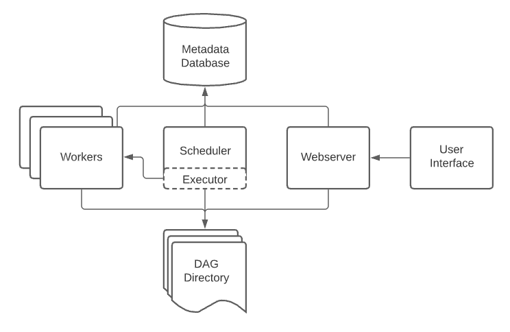

# Всем привет! :)

В этом проекте мы будем строить ETL-пайплан в airflow для получения ежедневных отчетов о интересующих нас метриках.

# Airflow: идея и интерфейс

## Что такое Apache Airflow?

**Apache Airflow** — это мощный инструмент для **организации, планирования и мониторинга рабочих процессов (ETL, аналитика, ML-пайплайны и т.д.)**.  
Он особенно удобен для задач вроде:

- **Extract** — извлечение данных из разных источников
- **Transform** — обработка и агрегация
- **Load** — загрузка в целевую систему

Airflow позволяет не просто запускать задачи по расписанию, но и **отслеживать их выполнение, логировать ошибки и управлять зависимостями** между ними.

---

## Интерфейс Airflow

Airflow состоит из нескольких ключевых компонентов:

| Компонент | Описание |
|----------|----------|
| **Webserver** | Веб-интерфейс, через который пользователь взаимодействует с Airflow |
| **Scheduler** | Следит за расписанием задач и запускает их, когда наступает время |
| **Executor** | Отвечает за **исполнение задач**. В реальных сценариях передаёт задачи на выполнение **воркерам** (Workers) |
| **Workers** | Удалённые процессы или машины, которые выполняют задачи |
| **DAG Directory** | Папка, в которой хранятся **DAG-файлы** — определения рабочих процессов |
| **Metadata Database** | Хранилище информации о состоянии задач, логах, истории запусков и т.д. |

---

## Что такое DAG?

**DAG** расшифровывается как **Directed Acyclic Graph** — направленный ациклический граф.

### Разберём по словам:

| Слово | Значение |
|-------|----------|
| **Directed (направленный)** | Задачи выполняются в **заданном порядке**, с указанием зависимостей между ними |
| **Acyclic (ациклический)** | Нет циклов — **один и тот же узел не выполняется дважды** за один запуск DAG |
| **Graph (граф)** | Набор задач и связей между ними, представленный визуально и логически как **граф зависимостей**

### Простыми словами

DAG — это **набор задач с чётко заданными зависимостями**.  
Например:
- Задача B может начаться **только после завершения задачи A**
- Задача C может запускаться **параллельно с B**
- Всё это описывается в виде **графа**, который Airflow визуализирует и исполняет
